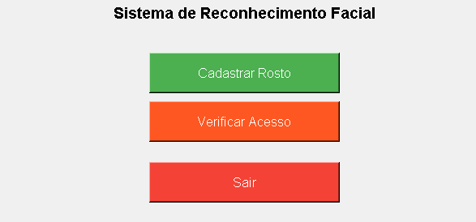
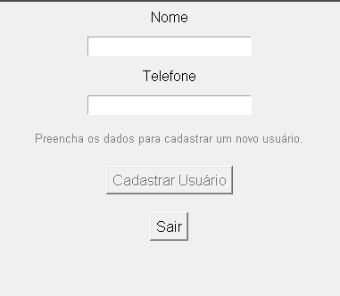
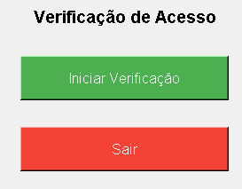

# Sistema de Reconhecimento Facial - Gerenciamento de Pessoas 


> Sistema de **gerenciamento de pessoas com reconhecimento facial**, utilizando OpenCV para captura de rostos e Tkinter para a interface gráfica. Permite adicionar, editar, excluir e trocar as imagens dos rostos registrados.

---

## 📌 Visão Geral

Este projeto é um **sistema de reconhecimento facial** que visa gerenciar informações de pessoas, como nome, telefone e rostos. Ele possibilita cadastrar, editar e excluir pessoas, além de atualizar suas imagens de rosto. A interface gráfica foi desenvolvida com Tkinter, garantindo uma interação simples e prática.

🔧 **Tecnologias utilizadas**:
- ✅ Python 3.x
- ✅ OpenCV (para captura e reconhecimento de rostos)
- ✅ Tkinter (para interface gráfica)
- ✅ Pillow (para manipulação de imagens)

---

## ✨ Funcionalidades

- **Cadastro de Pessoas:** Permite a adição de novas pessoas no sistema com nome, telefone e imagem do rosto.
- **Edição de Dados:** Atualize o nome e telefone das pessoas cadastradas.
- **Troca de Rosto:** Capture e atualize a imagem do rosto usando a webcam.
- **Exclusão de Pessoa:** Apaga os dados e as imagens de uma pessoa.
- **Interface Intuitiva:** Interface gráfica simples e fácil de usar com Tkinter.

---

## 📷 Preview





---

## 🚀 Como Usar

1. **Instalar as dependências:**
   - Instale as bibliotecas necessárias utilizando o comando:
   
   ```bash
   pip install opencv-python Pillow
# Gerenciamento-de-Pessoas-com-Reconhecimento-Facial

2. Executar o sistema:

Execute o script principal para abrir a interface gráfica:
  
   ```bash
python gerenciar_pessoas.py
```
Interações disponíveis:

Adicionar Pessoa: Clique em "Adicionar Pessoa" para inserir novos dados.

verificar Pessoa: Clique em "Verificar Acesso" para verificar o acesso.

Finalizar: Clique em "Sair" para fechar o programa.

📝 Observações
Este sistema não possui banco de dados, as informações são armazenadas em arquivos locais.

Recomendado para pequenos projetos de reconhecimento facial ou como protótipo para sistemas maiores.

🧠 Créditos
Desenvolvido por João Henrique Da Silva Gonçalves
Criação focada em uma interface simples e eficiente para gerenciar rostos e dados de pessoas com reconhecimento facial.

Agora, o README está todo em formato de código. Você pode copiar e colar em um arquivo `.md` para uso.
